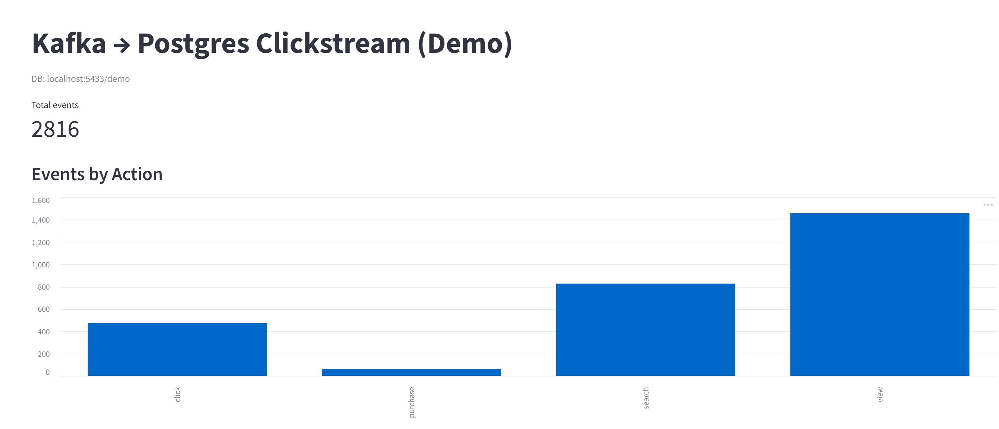

# Architecture:
flowchart LR
- A [Python Producer (planned)] --> B [JSON events]
- B                             --> C [Kafka Topic]
- C                             --> D [Python Consumer (planned)]
- D                             --> E [Postgres Database (planned)]
- E                             --> F [dbt Transformations (planned)]
- F                             --> G [Analytics / Dashboard (planned)]

Producer: Python script to emit fake click events as JSON.
Broker: Kafka local single-broker for demo to stream events in real time.
Consumer: Python process to read events and persist to Postgres.
Postgres: Stores raw events and transformed tables.
dbt: Aggregations (clicks per user/campaign/day).
Dashboard: Streamlit view of aggregates.

# Stack:
Python 3.12.9
Kafka (Docker)
confluent-kafka Python client
PostgreSQL (Docker)
dbt (Core)
Streamlit

# Requirements:
This demo uses Docker to run Kafka and Postgres locally.
- **Docker + Docker Compose**
  - On **Windows/macOS**: install Docker Desktop.
  - On **Linux**: install Docker Engine + Docker Compose plugin.
- **Python 3.9+** with `venv`/`pip`
- **Python client:** `confluent-kafka` (librdkafka-based, actively maintained)
  - Most platforms install prebuilt wheels. If your OS complains, install `librdkafka` from your package manager (e.g., `apt install librdkafka-dev` or `brew install librdkafka`).

# Getting Started
## Clone & set up:
```bash
git clone https://github.com/caiobassetti/streaming-pipeline.git
cd streaming-pipeline
pip install -r requirements.txt
```
If confluent-kafka fails to build, install librdkafka (Linux: apt install librdkafka-dev; macOS: brew install librdkafka) and retry.

### Environment variables
This project uses a .env file for database settings.
We do not commit real .env files — instead, copy the template
```bash
cp .env.example .env
```

## Start Kafka & Postgres (infra only):
Starts a single Kafka broker + Zookeeper + Postgres (empty DB)
```bash
docker compose up -d
```

Verify containers are running
```bash
docker ps
```
# Running:
## Run Producer:
```bash
python producer.py
```

### Expected Producer Output Sample:
```csharp
Producing to topic 'clicks' on localhost:9092 (Ctrl+C to stop)
→ {'event_id': '5c74a1b2-38a7-4ef9-89f9-9f3b8b7f6ad5', 'ts': '2025-08-23T14:32:10.123456+00:00', 'user_id': 104, 'campaign_id': 12, 'action': 'search', 'page': '/results'}
→ {'event_id': '6f2c92de-71ef-4bc0-8c3c-3d9fb6fca89f', 'ts': '2025-08-23T14:32:11.098765+00:00', 'user_id': 109, 'campaign_id': 14, 'action': 'view', 'page': '/home'}
→ {'event_id': '35e8a13a-7ab9-4e90-bf09-4c1d543dbf5f', 'ts': '2025-08-23T14:32:11.987654+00:00', 'user_id': 102, 'campaign_id': 13, 'action': 'click', 'page': '/search'}
→ {'event_id': '92fb7e45-89a4-4987-84c6-6c9f7c99daef', 'ts': '2025-08-23T14:32:12.654321+00:00', 'user_id': 107, 'campaign_id': 12, 'action': 'view', 'page': '/home'}
```

## Run Consumer (in a second terminal):
```bash
python consumer.py
```

### Expected Consumer Output Sample:
```csharp
Connected to Postgres at localhost:5433, DB=demo
Subscribed to Kafka topic 'clicks' (group=demo-consumer)
← consumed: {'event_id': '...', 'ts': '2025-08-23T15:12:00Z', 'user_id': 104, 'campaign_id': 12, 'action': 'search', 'page': '/results'}
← consumed: {...}
✓ inserted 5 rows into Postgres
← consumed: {...}
✓ inserted 5 rows into Postgres
```

## Mini Streamlit Dashboard (in a third terminal):
Run a simple live view of events and “events by action” aggregation.
```bash
streamlit run app.py
```

### Expected Dashboard Sample(auto-refresh every 5s):


# Stopping & Cleaning Up:
## Tear down Docker container (keeping volume):
```bash
docker compose down
```

## Tear down Docker and wipes down Kafka/ Postgres data:
```bash
docker compose down -v
```

# Roadmap
- add a basic CI step (GitHub Actions).
