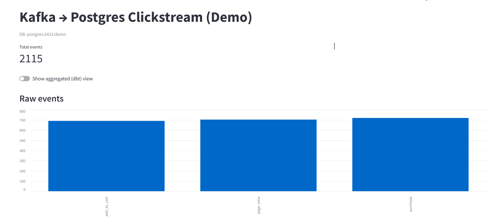

# Streaming Pipeline Demo — Kafka → Postgres → Airflow + dbt → Streamlit

# Architecture:
flowchart LR
- A [Python Producer] --> B [JSON events]
- B                   --> C [Kafka Topic]
- C                   --> D [Python Consumer]
- D                   --> E [Postgres Database]
- E                   --> F [dbt Transformations]
- F                   --> G [Analytics / Dashboard]

# Stack:
Producer: Python script to emit fake click events as JSON.<br>
Broker: Kafka local single-broker for demo to stream events in real time.<br>
Consumer: Python process to read events and persist to Postgres.<br>
Postgres: Stores raw events and transformed tables.<br>
Orchestration: Airflow orchestrates batch transformations and exports<>
dbt (inside Airflow): for SQL models and lineage.<br>
Streamlit: Dashboard with a toggle between **Live** (raw) and **Batch** (aggregated).<br>

# Requirements:
- Docker + Docker Compose (Windows/macOS: Docker Desktop; Linux: Engine + Compose plugin)

# Getting Started
## Clone & set up:
```bash
git clone https://github.com/caiobassetti/streaming-pipeline.git
cd streaming-pipeline
pip install -r requirements.txt
```

### Environment variables
This project uses a .env file for database settings.
```bash
cp .env.example .env
```

## Start Kafka & Postgres (infra only):
Starts a single Kafka broker + Zookeeper + Postgres (empty DB)
```bash
docker compose up -d
```

# Running Services:
Run services (producer, consumer and streamlit)
```bash
docker compose up -d producer consumer streamlit
```

**It's also possible to run each service manually on a separate terminal**
**To do it, follow the steps below**

## Running ServicesManually (Alternative)
### Install requirements:
```bash
python -m venv .venv && source .venv/bin/activate
pip install -r requirements.txt
```
### Run Producer:
```bash
python producer.py
```
### Expected Producer Output Sample:
```csharp
Producing to topic 'clicks' on localhost:9092 (Ctrl+C to stop)
→ {'event_id': '5c74a1b2-38a7-4ef9-89f9-9f3b8b7f6ad5', 'ts': '2025-08-23T14:32:10.123456+00:00', 'user_id': 104, 'campaign_id': 12, 'action': 'search', 'page': '/results'}
→ {'event_id': '6f2c92de-71ef-4bc0-8c3c-3d9fb6fca89f', 'ts': '2025-08-23T14:32:11.098765+00:00', 'user_id': 109, 'campaign_id': 14, 'action': 'view', 'page': '/home'}
→ {'event_id': '35e8a13a-7ab9-4e90-bf09-4c1d543dbf5f', 'ts': '2025-08-23T14:32:11.987654+00:00', 'user_id': 102, 'campaign_id': 13, 'action': 'click', 'page': '/search'}
→ {'event_id': '92fb7e45-89a4-4987-84c6-6c9f7c99daef', 'ts': '2025-08-23T14:32:12.654321+00:00', 'user_id': 107, 'campaign_id': 12, 'action': 'view', 'page': '/home'}
```

### Run Consumer (in a second terminal):
```bash
python consumer.py
```

### Expected Consumer Output Sample:
```csharp
Connected to Postgres at localhost:5433, DB=demo
Subscribed to Kafka topic 'clicks' (group=demo-consumer)
← consumed: {'event_id': '...', 'ts': '2025-08-23T15:12:00Z', 'user_id': 104, 'campaign_id': 12, 'action': 'search', 'page': '/results'}
← consumed: {...}
✓ inserted 5 rows into Postgres
← consumed: {...}
✓ inserted 5 rows into Postgres
```

## Run Streamlit (in a third terminal):
```bash
streamlit run app.py
```

### Expected Dashboard Sample(auto-refresh every 5s):


# Orchestration (Airflow + dbt):
Airflow runs a DAG that:
- refreshes a batch table `fct_events_by_action` in Postgres
- runs dbt models (`stg_raw_events`, `fct_events_by_action`) inside the Airflow container
- exports a CSV report artifact

## Starting Airflow:
```bash
cd airflow
echo "AIRFLOW_UID=50000" > .env
mkdir -p dags logs plugins dbt_project dbt_profiles reports
sudo chown -R 50000:0 dags logs plugins dbt_project dbt_profiles reports
sudo chmod -R 775 dags logs plugins dbt_project dbt_profiles reports
docker compose run --rm airflow-init
docker compose up -d
```

UI: http://localhost:8080 (admin / admin)

## Create Postgres Connection in Airflow UI:
Admin → Connections → +<br>
<br>
Conn Id: pg_demo<br>
Type: Postgres<br>
Host: host.docker.internal<br>
Port: 5433<br>
Schema: demo<br>
Login/Password: demo / demo<br>

## Trigger the DAG
Open the DAG clickstream_batch and click Trigger.<br>
Watch tasks in Graph view.<br>
CSV artifacts are written to /opt/airflow/reports inside the container.<br>

# Streamlit (Live vs Batch)
With Airflow running, it's possible to toggle the Stramlit visualization between:<br>
Live (raw_events) - direct query over the streaming table<br>
Batch (fct_events_by_action) - aggregated table refreshed by Airflow/dbt<br>

# Stopping & Cleaning Up:
## Stop Services (keeping volume):
```bash
docker compose down
cd airflow && docker compose down
```

## Stop Services (wiping DB):
```bash
docker compose down -v
cd airflow && docker compose down -v
```
