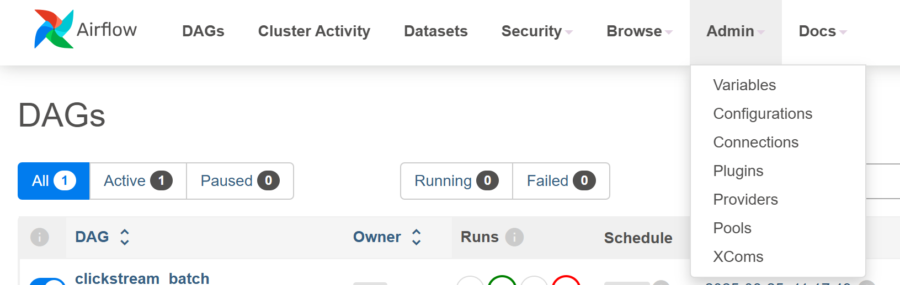

# Streaming Pipeline Demo — Kafka → Postgres → Airflow + dbt → Streamlit

# Stack:
Producer: Python script to emit fake click events as JSON.<br>
Broker: Kafka local single-broker for demo to stream events in real time.<br>
Consumer: Python process to read events and persist to Postgres.<br>
Postgres: Stores raw events and transformed tables.<br>
Orchestration: Airflow orchestrates batch transformations and exports<br>
dbt (inside Airflow): for SQL models and lineage.<br>
Streamlit: Dashboard with a toggle between **Live** (raw) and **Batch** (aggregated).<br>

# Requirements:
- Docker + Docker Compose (Windows/macOS: Docker Desktop; Linux: Engine + Compose plugin)

# Getting Started
## Clone & set up:
```bash
git clone https://github.com/caiobassetti/streaming-pipeline.git
cd streaming-pipeline
pip install -r requirements.txt
```

### Environment variables
This project uses a .env file for database settings.
```bash
cp .env.example .env
```

## Start Kafka & Postgres (infra only):
Starts a single Kafka broker + Zookeeper + Postgres (empty DB)
```bash
docker compose up -d
```

# Orchestration (Airflow + dbt):
Airflow runs a DAG that:
- refreshes a batch table `fct_events_by_action` in Postgres
- runs dbt models (`stg_raw_events`, `fct_events_by_action`) inside the Airflow container

## Starting Airflow:
```bash
cd airflow
docker compose up airflow-init
docker compose up -d
```
### Access UI: at http://localhost:8080 (admin / admin)


## Create Postgres Connection in Airflow UI:
### Navigate upper menu:
Admin → Connections → +<br>
<br>
<br>

Conn Id: pg_demo<br>
Type: Postgres<br>
Host: host.docker.internal<br>
Port: 5433<br>
Schema: demo<br>
Login/Password: demo / demo<br>
Save


## Trigger the DAG
### Navigate upper menu -> DAG:
Open the DAG clickstream_batch and click Trigger.<br>
Watch tasks in Graph view.<br>


# Streamlit (Live vs Batch)
With Airflow running, it's possible to toggle the Stramlit visualization between:<br>
Access Streamlit at http://localhost:8501/
Live (raw_events) - direct query over the streaming table<br>
Batch (fct_events_by_action) - aggregated table refreshed by Airflow/dbt<br>


# Stopping & Cleaning Up:
## Stop Services (keeping volume):
```bash
docker compose down
cd .. && docker compose down
```

## Stop Services (wiping DB):
```bash
docker compose down --volumes --rmi all
cd .. && docker compose down --volumes --rmi all
```
